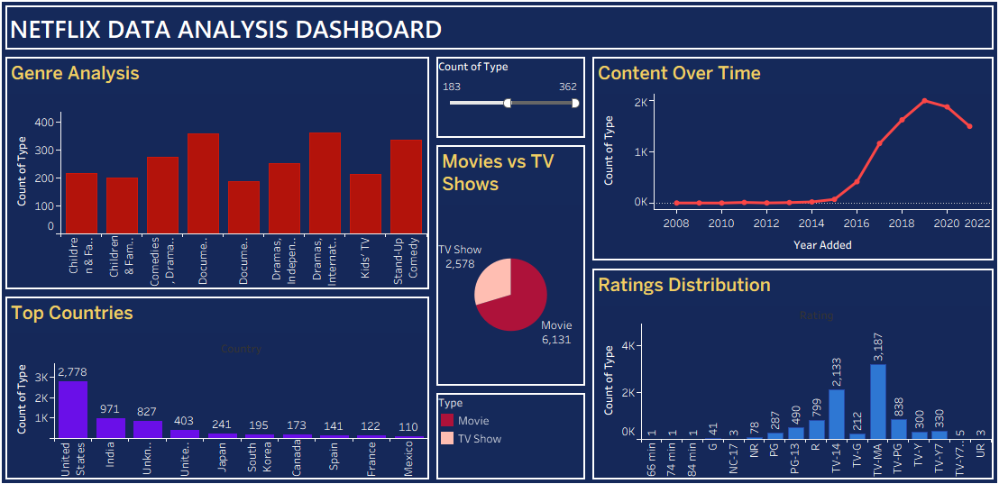

# 🎬 Netflix Data Analysis Project using Python and Tableau

##  Objective
To analyze Netflix content data and identify trends in content type, growth, and audience targeting using Python and Tableau.

---

##  Project Overview
This project focuses on analyzing Netflix Movies and TV Shows dataset to uncover trends in content distribution, growth over time, and audience targeting.

---

##  Dataset
The dataset used in this project is sourced from Kaggle:
🔗 https://www.kaggle.com/datasets/shivamb/netflix-shows

---

##  Tools & Technologies
- Python (Pandas, NumPy)
- Matplotlib (Data Visualization)
- Tableau (Dashboard Creation)

---

##  Data Cleaning Steps
- Handled missing values (director, cast, country, rating)
- Removed duplicate records
- Converted date columns into proper format
- Extracted year for time-based analysis

---

##  Exploratory Data Analysis
- Compared Movies vs TV Shows
- Analyzed content growth over years
- Identified top producing countries
- Studied ratings distribution
- Explored most popular genres

---

##  Key Insights
-  Netflix has more Movies than TV Shows
-  Content growth peaked around 2019
-  USA and India produce most content
-  Majority content is targeted at adult audience

---

##  Dashboard
An interactive dashboard was created using Tableau to visualize:
- Content distribution
- Yearly trends
- Country-wise analysis
- Genre and rating insights

---

## Dashboard Preview

---

##  Project Files 
- `cleaned_netflix_data.csv` → Cleaned dataset  
- `project_notebook.ipynb` → Python analysis  
- `Netflix_Dashboard.twbx` → Tableau dashboard
- `README.txt.txt` → README file 

---

##  Conclusion
This project demonstrates end-to-end data analysis workflow including data cleaning, analysis, visualization, and dashboard creation.
